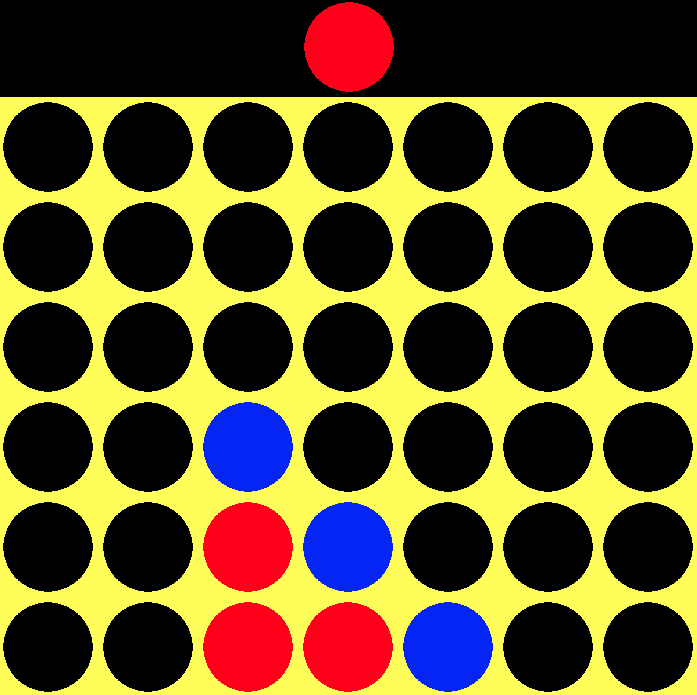

# Connect Four

<<<<<<< HEAD
=======

A python Connect Four game using Pygame. There is a CLI version and a graphical version.
To play, just download the file (`connect4.py` or `connect4_cli.py`) and run the file to play ($ `python connect4.py`)

>>>>>>> c1dd8ee053617d346a807ae46fbd60dd1dc17e7b
Adapted from [FreeCodeCamp.org](https://www.youtube.com/watch?v=XpYz-q1lxu8) and [FreeCodeCamp.org](https://www.youtube.com/watch?v=8392NJjj8s0)
